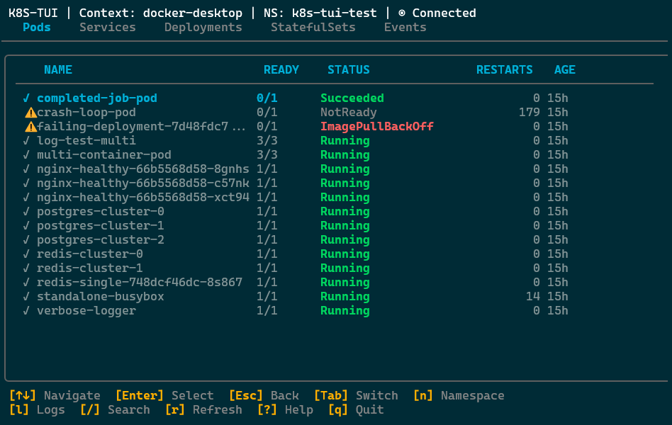

# K8S-TUI

[](https://github.com/williajm/k8s_tui/actions/workflows/ci.yml)
[](https://github.com/williajm/k8s_tui/actions/workflows/security.yml)
[](https://codecov.io/gh/williajm/k8s_tui)
[](https://goreportcard.com/report/github.com/williajm/k8s_tui)
[](https://github.com/williajm/k8s_tui/releases/latest)
[](https://opensource.org/licenses/MIT)
[](https://github.com/williajm/k8s_tui)

A fast, keyboard-driven terminal user interface for Kubernetes cluster management.

## Screenshot



## Features

### ✅ Available Now (v0.3.0 + Phase 4 on feature branch)

- **Multi-Resource Support**: View Pods, Services, Deployments, StatefulSets, and Events
- **Tab Navigation**: Switch between resource types with Tab/Shift+Tab or number keys (1-5)
- **Detail Views**: Press Enter to view comprehensive resource details
- **Pod Log Streaming**: Real-time log viewing with follow mode, timestamps, and container selection ('l' key)
- **Events Display**: View Kubernetes events with type filtering and age-based sorting (5th tab)
- **Describe Functionality**: Inspect resources in Describe, YAML, or JSON format ('d' key)
- **Namespace Switching**: Quick namespace selector with 'n' key
- **Search/Filter**: Real-time filtering with '/' key across all resource types
- **Auto-Refresh**: Resources update automatically every 5 seconds (polling) or in real-time (watch mode)
- **Real-Time Watch** (Phase 4): Event-driven updates via Kubernetes Watch API with automatic reconnection
- **Status Indicators**: Visual symbols (✓, ✗, ○, ⚠, ⊗) for resource health
- **Connection Status**: Live connection state indicator (Connected, Reconnecting, Disconnected, Error)
- **Keyboard-Driven**: Complete navigation without mouse
- **Fast & Lightweight**: Single binary, minimal resource usage

### 🚧 Coming Soon

- **Configuration**: Persistent settings and custom themes (Phase 5)
- **More Resources**: ConfigMaps, Secrets, Jobs, DaemonSets, etc. (Phase 6)
- **Virtual Scrolling**: Performance optimization for 1000+ resources
- **Write Operations**: Scale, delete, restart resources (Phase 7)

## Installation

### Download Binary (Recommended)

Download the latest release for your platform from the [releases page](https://github.com/williajm/k8s_tui/releases/latest).

**Linux:**
```bash
curl -LO https://github.com/williajm/k8s_tui/releases/latest/download/k8s-tui-linux-amd64
chmod +x k8s-tui-linux-amd64
sudo mv k8s-tui-linux-amd64 /usr/local/bin/k8s-tui
```

**macOS:**
```bash
# Intel Macs
curl -LO https://github.com/williajm/k8s_tui/releases/latest/download/k8s-tui-darwin-amd64
chmod +x k8s-tui-darwin-amd64
sudo mv k8s-tui-darwin-amd64 /usr/local/bin/k8s-tui

# Apple Silicon
curl -LO https://github.com/williajm/k8s_tui/releases/latest/download/k8s-tui-darwin-arm64
chmod +x k8s-tui-darwin-arm64
sudo mv k8s-tui-darwin-arm64 /usr/local/bin/k8s-tui
```

**Windows:**
Download `k8s-tui-windows-amd64.exe` from the releases page and add it to your PATH.

### From Source
```bash
git clone https://github.com/williajm/k8s-tui.git
cd k8s-tui
go build -o k8s-tui cmd/k8s-tui/main.go
```

### Prerequisites
- Go 1.21 or higher
- Access to a Kubernetes cluster
- Valid kubeconfig file

## Usage

### Basic Usage
```bash
# Use default kubeconfig
./k8s-tui

# Specify custom kubeconfig
./k8s-tui --kubeconfig ~/.kube/custom-config

# Start in specific namespace
./k8s-tui --namespace production

# Use specific context
./k8s-tui --context staging-cluster
```

### Keyboard Shortcuts

#### Global Navigation
- `Tab` / `Shift+Tab` - Switch between resource tabs
- `1-5` - Quick switch to tab (1=Pods, 2=Services, 3=Deployments, 4=StatefulSets, 5=Events)
- `/` - Search/filter in current list
- `Esc` - Cancel/go back
- `?` - Show help screen
- `q` - Quit application
- `r` / `F5` - Manual refresh

#### List Navigation
- `↑` / `↓` - Move up/down
- `Enter` - View resource details
- `Page Up` / `Page Down` - Page up/down
- `Home` / `End` - Go to top/bottom

#### Resource Actions
- `n` - Change namespace (opens selector dialog)
- `l` - View pod logs (from pods tab)
- `d` - Describe resource in multiple formats (from detail view)

#### Log Viewer
- `f` - Toggle follow mode (live streaming)
- `t` - Toggle timestamps
- `p` - View previous container logs
- `↑` / `↓` - Scroll through logs

#### Describe Viewer
- `d` - Describe format (structured view)
- `y` - YAML format
- `j` - JSON format
- `↑` / `↓` - Scroll through content

## Testing

### Manual Testing with Test Resources

The project includes comprehensive test Kubernetes resources for manual testing:

```bash
# Apply test resources
kubectl apply -f test-resources.yaml

# Run k8s-tui in test namespace
./k8s-tui -n k8s-tui-test

# Clean up when done
kubectl delete -f test-resources.yaml
```

See [TEST_RESOURCES.md](TEST_RESOURCES.md) for detailed testing scenarios and expected behavior.

### Automated Testing

Run the comprehensive test suite:

```bash
# Run all tests
go test ./...

# Run with coverage
go test -v -race -coverprofile=coverage.out -covermode=atomic ./...

# View coverage report
go tool cover -html=coverage.out
```

**Current Test Coverage:**
- ✅ **Models**: PodInfo, ServiceInfo, DeploymentInfo, StatefulSetInfo, EventInfo, LogEntry, DescribeData (all status symbols and health checks)
- ✅ **UI Components**: ResourceList, Tabs, Selector, LogViewer, DescribeViewer, ContainerSelector (navigation, filtering, state management)
- ✅ **Watch Infrastructure**: ExponentialBackoff, ResourceWatcher, WatchManager (connection management, error handling)
- ✅ **Styles**: Theme colors, status styles, rendering helpers
- ✅ **Total**: 287+ tests passing with race detector

## Configuration

**Note**: Configuration support is planned for Phase 5. Currently, k8s-tui uses sensible defaults:
- Update mode: Real-time watch with automatic fallback to 5-second polling
- Theme: Dark mode
- Default namespace: From kubeconfig context
- Connection management: Automatic reconnection with exponential backoff

Future configuration file location: `~/.k8s-tui/config.yaml` (Phase 5)

## Development

### Building from Source
```bash
# Clone repository
git clone https://github.com/williajm/k8s-tui.git
cd k8s-tui

# Install dependencies
go mod download

# Build binary
go build -o k8s-tui cmd/k8s-tui/main.go

# Run tests
go test ./...

# Run tests with coverage
go test ./... -coverprofile=coverage.out
go tool cover -html=coverage.out

# Run with race detector
go run -race cmd/k8s-tui/main.go
```

### Development Testing

```bash
# Run all tests
go test ./...

# Run with verbose output
go test -v ./...

# Run with coverage
go test -coverprofile=coverage.out ./...

# Run with race detector
go test -race ./...

# Run specific package
go test ./internal/models -v
```

### CI/CD

GitHub Actions automatically runs on every push and pull request:
- ✅ **Tests** on Ubuntu, macOS, and Windows with Go 1.21, 1.22, 1.23
- ✅ **Linting** with golangci-lint
- ✅ **Build** verification on all platforms
- ✅ **Coverage** reporting to Codecov

See [.github/workflows/ci.yml](.github/workflows/ci.yml) for details.

### Branch Protection

The `main` branch is protected with the following rules:
- 🔒 Require pull requests before merging (0 approvals for solo dev)
- ✅ Require status checks to pass (test, lint, build)
- 📝 Require linear history (rebase/squash only)
- 🚫 Prevent force pushes and branch deletion

**Development Workflow:**
```bash
# Work on feature branches
git checkout -b feature/my-feature
git push origin feature/my-feature

# Create PR on GitHub
# CI runs automatically
# Merge when checks pass
```

See [.github/DEVELOPMENT_WORKFLOW.md](.github/DEVELOPMENT_WORKFLOW.md) for detailed workflows.

### Project Structure
```
k8s-tui/
├── cmd/k8s-tui/              # Application entry point
├── internal/                 # Internal packages
│   ├── app/                 # Main Bubble Tea application (Model-Update-View)
│   ├── config/              # Configuration management
│   ├── k8s/                 # Kubernetes client wrapper
│   ├── models/              # Data models (PodInfo, ServiceInfo, etc.)
│   └── ui/                  # UI layer
│       ├── components/      # Reusable UI components (ResourceList, Tabs, Selector, etc.)
│       ├── keys/            # Keyboard bindings
│       └── styles/          # Lipgloss theme and styling
├── test-resources.yaml      # Kubernetes test resources
├── TEST_RESOURCES.md        # Manual testing guide
└── CLAUDE.md               # Development guidance
```

## Roadmap

See [CLAUDE.md](CLAUDE.md#development-roadmap) for the complete development roadmap.

### Phase 1 - Foundation (v0.1.0) ✅ Complete
- ✅ Basic Bubble Tea TUI framework
- ✅ Kubernetes client integration
- ✅ Pod listing and navigation
- ✅ CI/CD pipeline with cross-platform testing
- ✅ Unit testing infrastructure

### Phase 2 - Core Features (v0.2.0) ✅ Complete - Merged to Main
- ✅ Multi-resource support (Pods, Services, Deployments, StatefulSets)
- ✅ Tab navigation between resource types
- ✅ Detail views for all resources
- ✅ Namespace switching with selector dialog
- ✅ Search/filter functionality
- ✅ Real-time updates (5-second auto-refresh)
- ✅ Comprehensive unit tests for all Phase 2 components

### Phase 3 - Observability & Logs (v0.3.0) ✅ Complete - Merged to Main
- ✅ Pod log streaming view with follow mode and timestamps
- ✅ Container selector for multi-container pods
- ✅ Kubernetes events display (5th tab)
- ✅ Describe functionality with YAML/JSON/Describe formats
- ✅ Previous container logs support
- ✅ Log level detection and color coding

### Phase 4 - Real-time Watch & Performance (v0.4.0) ✅ Complete - Ready for PR
- ✅ Kubernetes Watch API integration
- ✅ Event-driven real-time updates (replaces polling)
- ✅ Automatic reconnection with exponential backoff
- ✅ Enhanced connection state indicator (5 states)
- ✅ Diff-based UI updates for performance
- ✅ Resource version tracking and 410 Gone handling
- ✅ 287+ tests passing with comprehensive coverage

### Phase 5 - Configuration & Customization (v0.5.0) 📋 Planned
- [ ] Configuration file support
- [ ] Theme system with multiple built-in themes
- [ ] UI preferences

### Phase 6 - Additional Resources (v0.6.0) 📋 Planned
- [ ] ConfigMaps, Secrets, Jobs, CronJobs, DaemonSets, etc.
- [ ] Nodes (cluster-level view)

### Phase 7 - Write Operations (v0.7.0+) 🔒 Future
- [ ] Delete pods/resources (with confirmation)
- [ ] Scale deployments
- [ ] Restart rollouts
- [ ] Safety features (confirmation dialogs, dry-run, audit logging)

## Contributing

Contributions are welcome! Please feel free to submit a Pull Request.

1. Fork the repository
2. Create your feature branch (`git checkout -b feature/amazing-feature`)
3. Commit your changes (`git commit -m 'Add amazing feature'`)
4. Push to the branch (`git push origin feature/amazing-feature`)
5. Open a Pull Request

## License

This project is licensed under the MIT License - see the [LICENSE](LICENSE) file for details.

## Acknowledgments

- Built with [Bubble Tea](https://github.com/charmbracelet/bubbletea) TUI framework
- Kubernetes client via [client-go](https://github.com/kubernetes/client-go)
- Inspired by [k9s](https://k9scli.io/) and [kubectl](https://kubernetes.io/docs/reference/kubectl/)